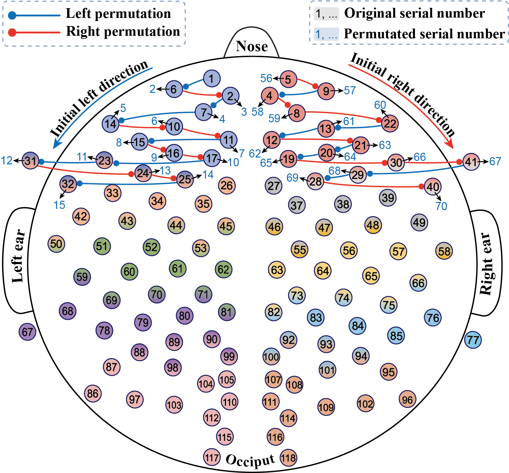

# 📌EEGProgress

🍊 __Overview__: A fast and lightweight progressive convolution architecture for EEG processing and classification. 

🍊 This project is based on our recent publication. You can access the original paper here: [Link: EEGProgress](https://www.sciencedirect.com/science/article/pii/S0010482523013665).


🍊 In this study, a progressive convolution CNN architecture named __"EEGProgress"__ is proposed, aiming to efficiently extract the topological spatial information of EEG signals from multi-scale levels (electrode, brain region, hemisphere, global) with superior speed.

## 🧰 How to run

🍊 You can directly run the code with __“test.py”__.

### 📕 Prerequisites

🍊 Before running the application, ensure that you have the following prerequisites installed:

      1. **Python:** The code is tested with Python 3.8. It should be compatible with most Python 3.x versions.
      
      2. **PyTorch:** This project requires PyTorch. If you haven't installed PyTorch yet, you can find installation instructions on the [official PyTorch website](https://pytorch.org/get-started/locally/).


### 📕 Settings

🍊 Once you have the environment set up, you can run __"test.py"__ with customized settings:

      1. You can select the __"Raw/Permutated EEG Data"__ with the code:
      
         ```bash
         Current_Datasets = 'a19_SpPe/'  # Permutated data
         Current_Datasets = 'a20_SpRaw/'  # Raw data
         ```

      2. You can set the __"Number of Training Epoch"__ with the code:
          ```bash
          Epoch = 150 # The original setting of the epoch is 150
          ```
    
# 📌 Topological Permutation

🍊 The raw EEG data is permuted using the __empirical topological permutation rule__, integrating the EEG data with numerous topological properties. 

